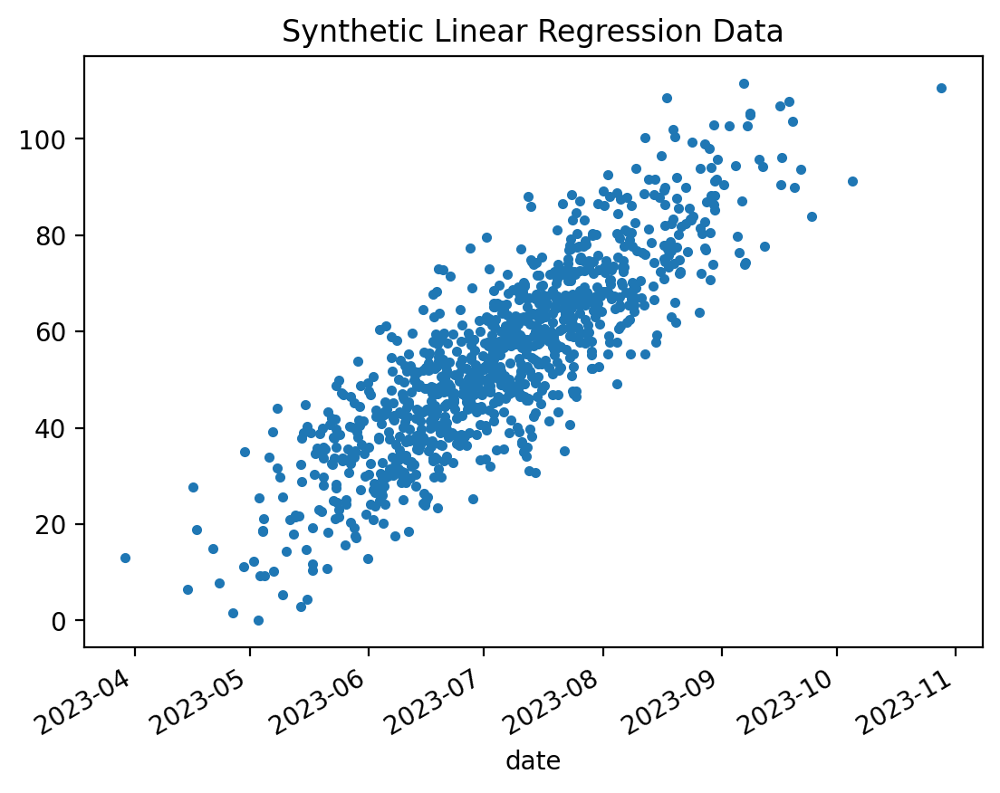
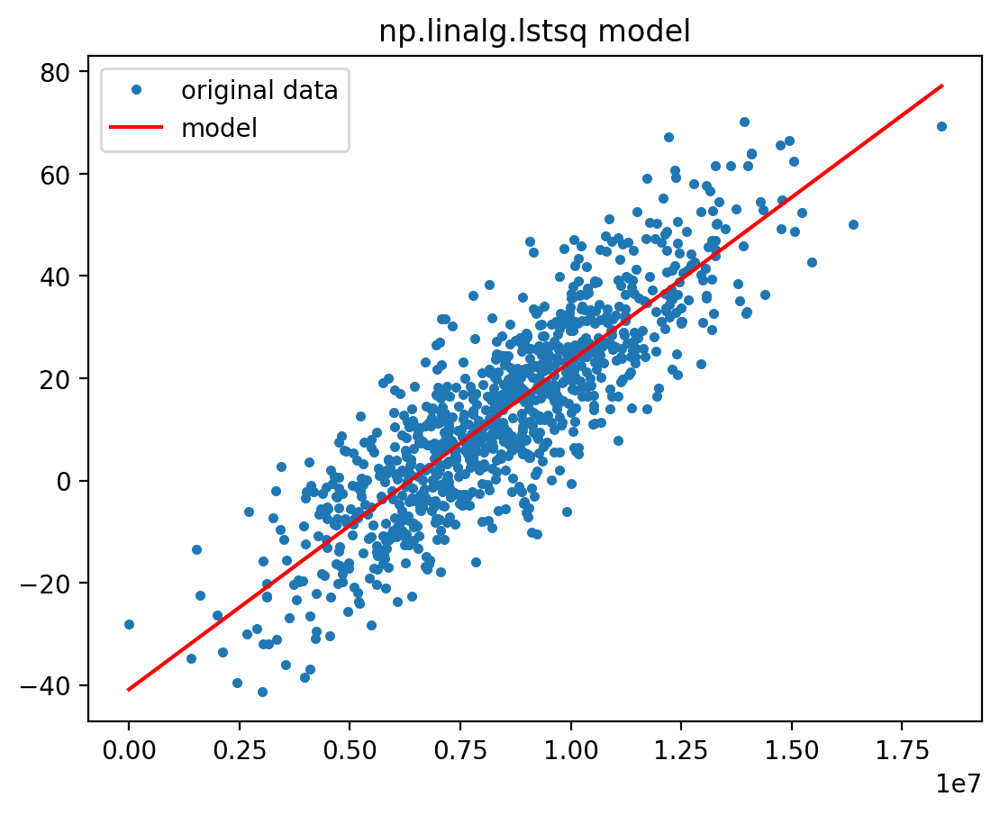

# Efficient Predictive Maintenance: Deploying a Linear Regression Model on AWS Lambda
## Optimize maintenance scheduling with a streamlined linear regression model on AWS Lambda, harnessing time series data for reliability.

Training a linear regression model for predictive maintenance is an important step, but taking it into production can be challenging. Traditional deployment methods, like using a web server or Docker, often require a lot of work in setting up and maintaining infrastructure, leading to increased costs in development, hardware, and software management.

In this article, we will introduce you to AWS Lambda, a cloud service that allows you to run your code without worrying about the underlying infrastructure. By deploying a linear regression model trainer and predictor on AWS Lambda, you can save both time and money, while focusing on developing and improving your predictive maintenance models. This serverless approach simplifies the process for machine learning developers who may not be experts in cloud computing, allowing you to deliver accurate predictions and better maintain your physical systems without the burden of managing the infrastructure.

## Setting Up Your Development Environment

Before we start implementing the linear regression predictor on AWS Lambda, let's ensure that you have the necessary tools installed and set up on your local machine. In this section, we will guide you through the installation process for the conda virtual environment manager, Jupyter Notebooks, and the AWS Serverless Application Model Command Line Interface (SAM CLI). In addition these tools, you'll also need to install scikit-learn, pandas, and matplotlib within your conda environment. These libraries will enable you to generate synthetic data, manipulate datasets, and visualize your results.

1. *Install Conda Virtual Environment Manager*: To create an isolated Python environment for your project, we recommend using conda. Download and install the appropriate version of Miniconda for your operating system from the [official website](https://docs.conda.io/en/latest/miniconda.html). Once installed, you can create a new virtual environment with the following command:

    ```text
    conda create --name my-env python=3.8
    ```

    Replace `my-env` with your preferred environment name. Activate your new environment with:

    ```text
    conda activate my-env
    ```

2. *Install Jupyter Notebooks and data science libraries*: With your conda environment activated,
install Jupyter Notebooks, scikit-learn, matplotlib and pandas by running:

    ```text
    conda install -c conda-forge notebook scikit-learn matplotlib pandas
    ```

3. *Install AWS SAM CLI*: The SAM CLI is an essential tool for building and deploying serverless applications on AWS Lambda. You can follow the [official AWS guide](https://docs.aws.amazon.com/serverless-application-model/latest/developerguide/serverless-sam-cli-install.html) to install the SAM CLI on your machine.

After installing scikit-learn, pandas, and matplotlib, your development environment will be ready for generating, processing, and visualizing synthetic sensor data in a Jupyter Notebook.

## Simulating Noisy Sensor Data with Synthetic Examples

For the sake of simplicity, we will use synthetic data to simulate a noisy sensor in our predictive maintenance scenario. To generate this synthetic data, we will employ the widely used scikit-learn Python library. Scikit-learn provides a variety of tools for creating and processing datasets, making it an ideal choice for our purposes.

In order to visualize the generated data and better understand its characteristics, we will use a Jupyter Notebook. Jupyter Notebooks offer an interactive and user-friendly environment, enabling us to display plots and charts alongside our code, which makes data analysis more efficient and comprehensible.

Launch Jupyter Notebook with the command:

```text
jupyter notebook
```

Create a new notebook instance and enter the following code snippet that uses the scikit-learn library to generate
a synthetic dataset for the regression problem:

```python
from sklearn.datasets import make_regression
from matplotlib import pyplot as plt

gt_samples = 1000       # The number of samples (data points) in the generated dataset.
gt_noise = 10           # The standard deviation of the Gaussian noise to be added to the output
                        # in order to simulate noisy sensor data.
gt_bias = 13            # The bias term, which represents the intercept of the underlying linear function.
gt_random_state = 42    # A seed for the random number generator, ensuring that the generated
                        # dataset is reproducible.

X, y, gt_coef = make_regression(
    n_samples=gt_samples,
    n_features=1,
    bias=gt_bias,
    noise=gt_noise,
    coef=True,
    random_state=gt_random_state
)
```

Let's visualize the generated synthetic dataset with matplotlib:

```python
x = X.reshape(-1)
plt.plot(x, y, '.')
plt.title('Synthetic Linear Regression Data')
plt.show()
print(f'ground truth coef = {gt_coef:.04f}, bias = {gt_bias:.04f}')
```



```text
ground truth coef = 16.7483, bias = 13.0000
```

Let's save the generated data as a comma-separated values (CSV) file:

```python
pd.DataFrame(np.stack((x, y), axis=1), columns=('x', 'y')).to_csv('./data/data.csv', index=False)
```

## Efficient Linear Regression Model with NumPy

In the next section, we will focus on training a linear regression model using the noisy data generated earlier. Most online tutorials and resources utilize the `sklearn.linear_model.LinearRegression` class from the scikit-learn library for this purpose. However, in this guide, we will use the `numpy.linalg.lstsq` function instead.

There are two main reasons for choosing the `numpy.linalg.lstsq` function over the scikit-learn approach:

1. *Performance*: The `numpy.linalg.lstsq` function is typically an order of magnitude faster than the `LinearRegression` class, making it a more efficient choice for training linear regression models, especially for large datasets.
2. *Smaller dependency footprint*: When deploying your linear regression model to AWS Lambda, minimizing the size of your Python dependencies is crucial. Using the `lstsq` function from `numpy` allows you to avoid importing the entire scikit-learn library, resulting in a much smaller dependency footprint.

By leveraging the `numpy.linalg.lstsq` function for training our linear regression model, we can achieve better performance and a more lightweight deployment, which will be highly beneficial when it comes to deploying our function on AWS Lambda. Here is how to do it:

```python
import numpy as np

A = np.vstack([x, np.ones(len(x))]).T
coef, bias = np.linalg.lstsq(A, y, rcond=None)[0]
```

After importing `numpy`, the first line creates a 2D array `A` with two columns. The first column contains the feature values `x` from the synthetic dataset, and the second column is filled with ones. The purpose of adding a column of ones is to include a constant term (bias or intercept) in the linear regression model (see also the example in the [numpy documentation](https://numpy.org/doc/stable/reference/generated/numpy.linalg.lstsq.html)). The `np.vstack()` function stacks the two input arrays vertically, and the `.T` attribute transposes the resulting array to obtain the desired shape.

The second line performs the actual linear regression by solving the least squares problem using the `numpy.linalg.lstsq` function. The function takes three arguments:

 - `A`: The previously created 2D array containing the feature values x and a column of ones.
 - `y`: The output values (dependent variable) from the synthetic dataset.
 - `rcond=None`: This parameter is used to set the relative condition number for determining the rank of the input matrix A. When set to None, the function uses a machine-dependent value as the cutoff.

The `lstsq` function returns several values, but we are only interested in the first element of the output tuple, which contains the least squares solution (i.e., the coefficients of the linear regression model). By using array unpacking, we assign the first element of the solution (the slope or weight) to the variable coef and the second element (the bias or intercept) to the variable bias.

Let's visualize now the obtained model!

```python
plt.plot(x, y, '.', label='Original data', markersize=5)
plt.plot(x, coef*x + bias, 'r', label='model')
plt.title('np.linalg.lstsq model')
plt.legend()
plt.show()

print(f'np.linalg.lstsq coef={coef:.04f}, bias={bias:.04f}')
```



```text
np.linalg.lstsq coef=16.6335, bias=13.0453
```

We can also see that the model estimates a coefficient of 16.6335 and a bias of 13.0453 for the underlying data that are quite good approximates of the ground truth 16.7483 and 13.0000 values.

