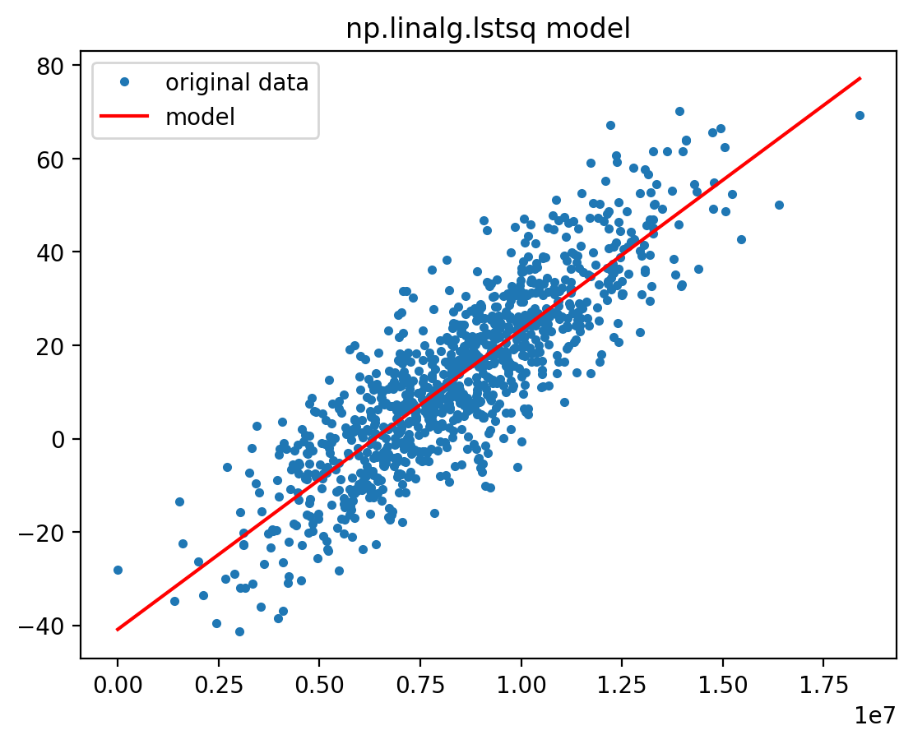

# Efficient Predictive Maintenance: Deploying a Linear Regression Model on AWS Lambda - Part 1
## The Problem of Predictive Maintenance and Creating a Synthetic Dataset

This article is part of a series that covers the implementation of a linear regression model on noisy sensor data. The aim is to predict when observed metrics will exceed a specific threshold, indicating the need for system repair. Throughout the series, we will generate synthetic sensor data, construct predictive models, and deploy them on AWS Lambda service for production readiness. You will find practical steps that you can follow to utilize this approach in real-world scenarios.

This is the first article in the series. We will explain the usefulness of linear regression in predictive maintenance, create a synthetic dataset, train a model, and predict the maintenance date. In the second article we will discuss how to deploy the model to AWS Lambda. You can find all parts here:

 1. The Problem of Predictive Maintenance and Creating a Synthetic Dataset [link to this]
 2. TBD

## Introduction: Using Linear Regression in Predictibe Maintenance

Predictive maintenance has become a widely adopted approach for companies to optimize their maintenance operations and reduce downtime. It involves leveraging data and analytics to forecast when a machine or system is likely to fail, allowing maintenance to be performed proactively before the failure occurs. By using this proactive approach, companies can save significant amounts of money by preventing expensive equipment failures and minimizing downtime.

One common method for predictive maintenance is using linear regression. The assumption here is that there is a dependent variable in the system that is linearly proportional to the deterioration of the system. This can be seen in many industrial applications, such as monitoring the pressure of air filters. In this scenario, a pair of sensors measures the pressure before and after the air filter, and the difference in pressure is used to determine when the filter needs to be changed. However, the sensors provide noisy data, so a model needs to be created to accurately predict when the pressure difference will reach a certain threshold that indicates the filter needs to be changed.

## Setting Up Your Development Environment

Before we start implementing the linear regression predictor, let's ensure that you have the necessary tools installed and set up on your local machine. In this section, we will guide you through the installation process for the conda virtual environment manager, Jupyter Notebooks, and the AWS Serverless Application Model Command Line Interface (SAM CLI). In addition these tools, you'll also need to install scikit-learn, pandas, and matplotlib within your conda environment. These libraries will enable you to generate synthetic data, manipulate datasets, and visualize your results.

1. *Install Conda Virtual Environment Manager*: To create an isolated Python environment for your project, we recommend using conda. Download and install the appropriate version of Miniconda for your operating system from the [official website](https://docs.conda.io/en/latest/miniconda.html). Once installed, you can create a new virtual environment with the following command:

    ```text
    conda create --name my-env python=3.8
    ```

    Replace `my-env` with your preferred environment name. Activate your new environment with:

    ```text
    conda activate my-env
    ```

2. *Install Jupyter Notebooks and data science libraries*: With your conda environment activated,
install Jupyter Notebooks, scikit-learn, matplotlib and pandas by running:

    ```text
    conda install -c conda-forge notebook scikit-learn matplotlib pandas
    ```

3. *Install AWS SAM CLI*: The SAM CLI is an essential tool for building and deploying serverless applications on AWS Lambda. You can follow the [official AWS guide](https://docs.aws.amazon.com/serverless-application-model/latest/developerguide/serverless-sam-cli-install.html) to install the SAM CLI on your machine.

After installing scikit-learn, pandas, and matplotlib, your development environment will be ready for generating, processing, and visualizing synthetic sensor data in a Jupyter Notebook.

## Simulating Noisy Sensor Data with Synthetic Examples

For the sake of simplicity, we will use synthetic data to simulate a noisy sensor in our predictive maintenance scenario. To generate this synthetic data, we will employ the widely used scikit-learn Python library. Scikit-learn provides a variety of tools for creating and processing datasets, making it an ideal choice for our purposes.

In order to visualize the generated data and better understand its characteristics, we will use a Jupyter Notebook. Jupyter Notebooks offer an interactive and user-friendly environment, enabling us to display plots and charts alongside our code, which makes data analysis more efficient and comprehensible.

Launch Jupyter Notebook with the command:

```text
jupyter notebook
```

Create a new notebook instance and enter the following code snippet that uses the scikit-learn library to generate
a synthetic dataset for the regression problem:

```python
from sklearn.datasets import make_regression
from matplotlib import pyplot as plt

gt_samples = 1000       # The number of samples (data points) in the generated dataset.
gt_noise = 10           # The standard deviation of the Gaussian noise to be added to the output
                        # in order to simulate noisy sensor data.
gt_bias = 13            # The bias term, which represents the intercept of the underlying linear function.
gt_random_state = 42    # A seed for the random number generator, ensuring that the generated
                        # dataset is reproducible.

X, y, gt_coef = make_regression(
    n_samples=gt_samples,
    n_features=1,
    bias=gt_bias,
    noise=gt_noise,
    coef=True,
    random_state=gt_random_state
)
x = X.reshape(-1)
```

When dealing with sensor readings, most likely the data will arrive in time series format. Thus we will change the x axis of our dataset to timestamps. To be able to convert back model predictions to timestamps.

```python
import pandas as pd
import numpy as np
import datetime

df = pd.DataFrame(np.stack((x, y), axis=1), columns=('x', 'y'))
x_to_dt = lambda x: datetime.timedelta(days=x * 30)
start = datetime.datetime.now() - x_to_dt(min(df['x']))
dt_index = [start + x_to_dt(x) for x in df['x']]
df.index = pd.DatetimeIndex(dt_index, name='date')
df = df.sort_index().drop(columns='x')
df.head()
```

Our dataset looks like this:
```text
date                                    y
2023-03-29 09:19:20.207695     -28.145488
2023-04-14 17:16:34.974649     -34.823622
2023-04-16 02:20:11.409799     -13.469901
2023-04-17 00:49:05.843353     -22.405377
2023-04-21 11:27:02.608824     -26.338877
```

This simulates sensor readings at non regular intervals, the most generic case that you might face in real-world scenarios.

Let's visualize the generated synthetic dataset with matplotlib:


```python
df['y'].plot(style='.')
plt.title('Synthetic Linear Regression Data')
plt.show()
```


Save the generated data as a comma-separated values (CSV) file:

```python
pd.DataFrame(np.stack((x, y), axis=1), columns=('x', 'y')).to_csv('./data/data.csv', index=False)
```

## Efficient Linear Regression Model with NumPy

### Preprocessing

In the Python snippet, we load the dataset in CSV format with Pandas, which emulates acquiring data from an external source. To facilitate further processing, we must transform the timestamp values into numeric representations. We achieve this by "normalizing" these values using the earliest timestamp (`start_date`) as the reference point and expressing the difference in seconds. We will take note of `start_date` and the information that the dataset units are seconds, so we can convert back model predictions to timestamps.

```python
import pandas as pd

df = pd.read_csv(dataset_path, parse_dates=['date'])
start_date = df['date'].min()
df['x'] = (df['date'] - start_date).dt.total_seconds()
x = df['x'].to_numpy()
y = df['y'].to_numpy()
```

In the next section, we will focus on training a linear regression model using the noisy data generated earlier. Most online tutorials and resources utilize the `sklearn.linear_model.LinearRegression` class from the scikit-learn library for this purpose. However, in this guide, we will use the `numpy.linalg.lstsq` function instead.

There are two main reasons for choosing the `numpy.linalg.lstsq` function over the scikit-learn approach:

1. *Performance*: The `numpy.linalg.lstsq` function is typically an order of magnitude faster than the `LinearRegression` class, making it a more efficient choice for training linear regression models, especially for large datasets.
2. *Smaller dependency footprint*: When deploying your linear regression model to AWS Lambda, minimizing the size of your Python dependencies is crucial. Using the `lstsq` function from `numpy` allows you to avoid importing the entire scikit-learn library, resulting in a much smaller dependency footprint.

By leveraging the `numpy.linalg.lstsq` function for training our linear regression model, we can achieve better performance and a more lightweight deployment, which will be highly beneficial when it comes to deploying our function on AWS Lambda.

In our scenario, "training" the model using NumPy precisely corresponds to solving an over-determined linear matrix equation through a least-squares solution. Here is how to do it:

```python
import numpy as np

A = np.vstack([x, np.ones(len(x))]).T
coef, bias = np.linalg.lstsq(A, y, rcond=None)[0]
```

After importing `numpy`, the second line creates a 2D array `A` with two columns. The first column contains the feature values `x` from the synthetic dataset, and the second column is filled with ones. The purpose of adding a column of ones is to include a constant term (bias or intercept) in the linear regression model (see also the example in the [numpy documentation](https://numpy.org/doc/stable/reference/generated/numpy.linalg.lstsq.html)). The `np.vstack()` function stacks the two input arrays vertically, and the `.T` attribute transposes the resulting array to obtain the desired shape.

The third line performs the actual linear regression by solving the least squares problem using the `numpy.linalg.lstsq` function. The function takes three arguments:

 - `A`: The previously created 2D array containing the feature values x and a column of ones.
 - `y`: The output values (dependent variable) from the synthetic dataset.
 - `rcond=None`: This parameter is used to set the relative condition number for determining the rank of the input matrix A. When set to None, the function uses a machine-dependent value as the cutoff.

The `lstsq` function returns several values, but we are only interested in the first element of the output tuple, which contains the least squares solution (i.e., the coefficients of the linear regression model). By using array unpacking, we assign the first element of the solution (the slope or weight) to the variable coef and the second element (the bias or intercept) to the variable bias. These are the model's parameters that we will use for model prediction.

Let's visualize now the obtained model!

```python
from matplotlib import pyplot as plt

plt.plot(x, y, '.', label='original data')
plt.plot(x, coef * x + bias, 'r', label='model')
plt.title('np.linalg.lstsq model')
plt.legend()
plt.show()
```



## Predicting maintenance date

Over time, the system experiences degradation, leading to a rise in the observed metrics. Utilizing linear regression, the model forecasts future metric values. Eventually, the predicted value surpasses a pre-established threshold, signifying the need for system repair beyond this point. The exact value of the threshold is specific to the problem domain and the scale of the metrics, here we will use an arbitrary value of 100. We will calculate the crossing moment using the `coef` and `bias` parameters along the numeric `y` axis, then convert the crossing to a date using the `start_date` and seconds as unit.

```python
target_threshold = 100

crossing = (target_threshold - bias) / coef
crossing_dt = start_date + pd.Timedelta(seconds=crossing)
print(f'Predicted threshold crossing: {crossing_dt}')
```

Output:
```text
Predicted threshold crossing: 2023-12-08 12:25:47.156814252
```
